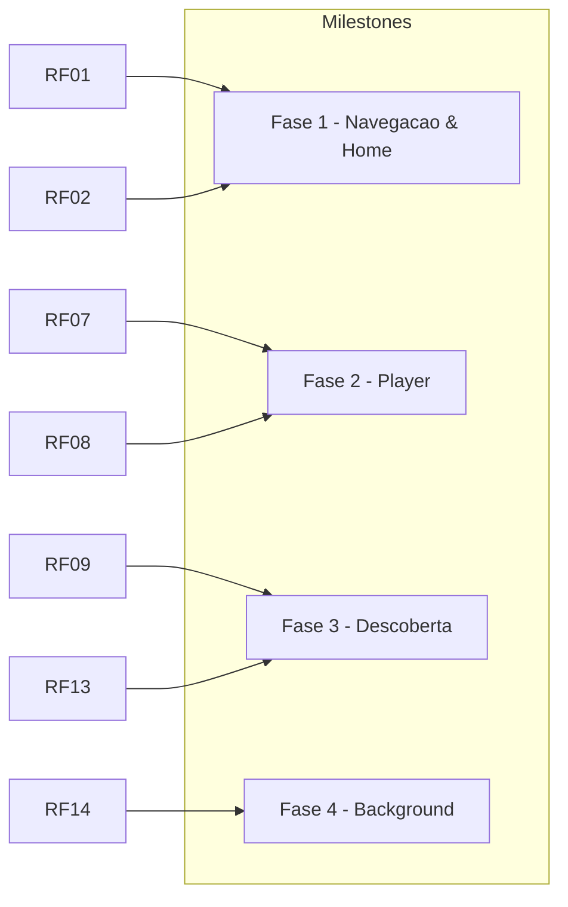

# 01 — Requisitos

> Fonte: Podcastr NLW + adaptações mobile-first (mini-player, bottom sheet, background).

## 1. Requisitos Funcionais

| ID | Título | Descrição | Prioridade | Milestone | Issues | Status |
|----|--------|-----------|------------|-----------|--------|--------|
| **RF-01** | Listar episódios | Home exibe **Últimos lançamentos** (2 primeiros, carrossel horizontal) e **Todos episódios** (lista vertical) com capa, título, membros, data e duração. | M | Fase 1 | #1, #2 | 🔳 Pendente |
| **RF-02** | Tocar episódio | Tocar um episódio da lista inicia playback imediato e torna-se o `currentEpisode`. Tocar outro substitui ou entra na fila conforme origem. | M | Fase 1 | #2 | 🔳 |
| **RF-03** | Tocar fila | `playList(lista, index)` toca a fila inteira a partir do índice escolhido (comportamento Podcastr original). | M | Fase 2 | #3 | 🔳 |
| **RF-04** | Controles básicos | Player oferece **play/pause, próximo, anterior, seek (arrastar progresso)**. | M | Fase 2 | #3, #5 | 🔳 |
| **RF-05** | Shuffle | Embaralha ordem da fila ao avançar (`isShuffling`). Toggle com feedback visual. | S | Fase 2 | #3, #5 | 🔳 |
| **RF-06** | Repeat/Loop | Repete episódio atual quando ativo (`isLooping`). Se `loop` + fim da fila, volta ao início. | S | Fase 2 | #3, #5 | 🔳 |
| **RF-07** | Mini-player | Barra fixa 64dp acima da TabBar com capa 48, título, membros, play/pause e barra fina de progresso. Tap expande. | M | Fase 2 | #4 | 🔳 |
| **RF-08** | Full-player | BottomSheet expansível (55% → 92%) com capa grande, slider, controles centrais e metadados. Gesto pan-to-close. | M | Fase 2 | #5 | 🔳 |
| **RF-09** | Ver detalhe | Tela de detalhe mostra capa grande, título, membros, data, duração, descrição HTML e ações (Tocar, Fila, Favoritar, Compartilhar). | M | Fase 3 | #6 | 🔳 |
| **RF-10** | Buscar | Busca textual por título/membros com debounce, empty state e histórico. | S | Fase 3 | #6 | 🔳 |
| **RF-11** | Favoritar | Favoritar/desfavoritar episódio (heart). Lista em Biblioteca. | S | Fase 3 | #6 | 🔳 |
| **RF-12** | Biblioteca | Aba com favoritos e (futuro) histórico. CTA quando vazio. | S | Fase 3 | #6 | 🔳 |
| **RF-13** | Persistir progresso | Salva `episodeList`, `currentIndex` e `currentTime` em `AsyncStorage` (throttle 1s). Ao reabrir, oferece continuar. | S | Fase 3 | #7 | 🔳 |
| **RF-14** | Background | Toca com app em background, tela bloqueada, com controles na notificação/lockscreen. | M | Fase 4 | #8 | 🔳 |
| **RF-15** | Velocidade | (Could) Ajustar playbackRate 1x/1.5x/2x. | C | Fase 4 | #5 | 🔳 |

## 2. Requisitos Não-Funcionais

| ID | Categoria | Requisito | Métrica | Prioridade |
|----|-----------|-----------|---------|------------|
| **RNF-01** | Performance | Scroll da Home e animações do BottomSheet a 60fps, sem jank. | `FlatList` + `Reanimated` UI thread, `useDerivedValue` | M |
| **RNF-02** | Performance | Tempo até tocar < 800ms após tap. | `expo-audio` pré-load | M |
| **RNF-03** | Plataforma | iOS 15+ e Android 8+ (API 26). Expo SDK 53, New Architecture. | `app.json:09` | M |
| **RNF-04** | Áudio | Não parar ao silenciar hardware (iOS) nem ao receber notificação (duck). | `playsInSilentMode:true`, `duckOthers` | M |
| **RNF-05** | Confiabilidade | Fila e progresso sobrevivem a kill do app. | `AsyncStorage` + throttle | S |
| **RNF-06** | Acessibilidade | Alvos de toque ≥ 44dp, contraste AA, labels para leitores. | — | S |
| **RNF-07** | Offline (futuro) | (Could) Cache de capas e download de episódio. | — | C |
| **RNF-08** | Observabilidade | `expo-doctor 18/18`, `tsc --noEmit` sem erros, builds EAS reproduzíveis. | CI | M |
| **RNF-09** | Segurança | Permissões mínimas: apenas `FOREGROUND_SERVICE_MEDIA_PLAYBACK`, `WAKE_LOCK`, `UIBackgroundModes audio`. | `app.json:20` | M |
| **RNF-10** | Manutenibilidade | Código 100% TypeScript strict, store isolada, sem lógica em componentes. | `src/store/*` | M |

## 3. Priorização MoSCoW (MVP)

- **Must (Fase 1-2):** RF-01, RF-02, RF-03, RF-04, RF-07, RF-08, RF-14, RNF-01..04, RNF-08 — sem isso não é um player.
- **Should (Fase 3):** RF-05, RF-06, RF-09..13, RNF-05..06 — experiência completa Podcastr.
- **Could:** RF-15, RNF-07 — diferenciais.
- **Won't (nesta versão):** Login, upload de podcasts, comentários, streaming P2P, monetização.

## 4. Rastreabilidade

## 5. Critérios de aceite gerais

- [ ] `npx tsc --noEmit` passa
- [ ] `npx expo-doctor` 18/18
- [ ] Testado em Expo Go (foreground) + dev build (background) — ver `docs/05-arquitetura.md`
- [ ] Sem regressão: tocar lista não quebra MiniPlayer, fechar sheet não para áudio

## 6. Fora de escopo (v0.1 → v1.0)

Autenticação, perfis, upload, transcrição, IA, push, analytics, ads. Podem virar `Could` em v2 com `W` atual.

---

*Próximo: [02 — Regras de Negócio](./02-regras-de-negocio.md)*
