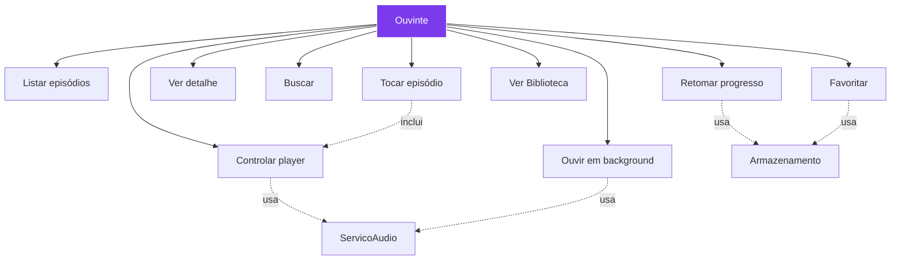
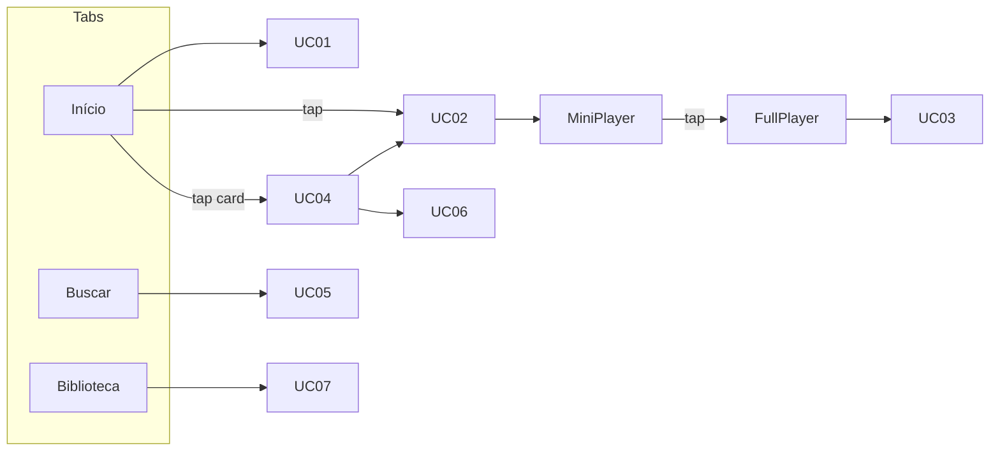

# 03 — Casos de Uso

## 1. Atores

| Ator | Descrição | Exemplos |
|------|-----------|----------|
| **Ouvinte** | Usuário final, sem login | Toca, pausa, favorita |
| **Sistema (App)** | Orquestra UI + store + player | Navega, persiste |
| **Serviço de Áudio** | `expo-audio` + SO (Media3/AVFoundation) | Toca, background, lockscreen |
| **Armazenamento** | `AsyncStorage` | Salva fila/progresso/favoritos |

## 2. Diagrama Geral

## 3. Detalhamento

### UC-01 — Listar episódios
**Objetivo:** Ouvinte vê Home com últimos e todos.
**Pré:** App aberto na aba Início.
**Fluxo principal:**
1. Sistema carrega `episodesMock` (`src/mocks/episodes.ts:4`)
2. Renderiza `Últimos lançamentos` (2 primeiros, carrossel horizontal) e `Todos` (restante, lista vertical)
3. Cada item mostra capa, título (2 linhas), membros, data formatada (`src/lib/format.ts:1`) e duração
**Alternativos:**
- 1a. Lista vazia → empty state “Nenhum episódio”
**Pós:** Lista visível, pronta para UC-02.
**RF:** RF-01
**RN:** RN-08, RN-09

---

### UC-02 — Tocar episódio
**Pré:** UC-01 concluído.
**Fluxo:**
1. Ouvinte toca play no item (ou no detalhe)
2. Sistema chama `playList(lista, index)` (ou `play(episode)` se isolado) em `src/store/playerStore.ts:1`
3. `PlayerProvider` recria `useAudioPlayer({uri})`, `setActiveForLockScreen(true)`, `play()`
4. `MiniPlayer` aparece, `useAudioPlayerStatus` atualiza progresso
**Alternativos:**
- 2a. Já tocando outro → substitui fila e toca novo
- 2b. Erro de URL → RN-18 (toast + tenta próximo)
**Pós:** `isPlaying=true`, `currentIndex` definido.
**RF:** RF-02, RF-03
**RN:** RN-01, RN-02, RN-03

---

### UC-03 — Controlar player
**Pré:** UC-02 com episódio carregado.
**Fluxo:**
1. Ouvinte usa controles no `MiniPlayer` ou `FullPlayerSheet`
   - **Play/Pause:** `togglePlay()` ↔ `player.play()/pause()`
   - **Próximo:** `playNext()` (RN-04/05/06)
   - **Anterior:** `playPrevious()`
   - **Seek:** arrasta slider → `player.seekTo(seconds)` (RN-07)
   - **Shuffle/Loop:** toggle `isShuffling`/`isLooping` com cor `#7C3AED` quando ativo
2. Sistema atualiza `useAudioPlayerStatus` e persiste a cada 1s (RN-12)
**Alternativos:**
- 3a. Fim do episódio → `didJustFinish` dispara `playNext()` ou pausa (RN-06)
**Pós:** Estado `isPlaying/isShuffling/isLooping` consistente.
**RF:** RF-04, RF-05, RF-06, RF-07, RF-08
**RN:** RN-04, RN-05, RN-06, RN-07, RN-10, RN-11

---

### UC-04 — Ver detalhe do episódio
**Pré:** Ouvinte toca card (não o botão play) na Home ou Busca.
**Fluxo:**
1. Sistema navega `navigation.navigate('EpisodeDetail', {id})`
2. Busca episódio em `episodesMock` por `id`
3. Renderiza capa 160, título, membros, data, duração, descrição HTML (`react-native-render-html`)
4. Ações: `Tocar agora`, `Adicionar à fila`, `Favoritar`, `Compartilhar`
**Pós:** Detalhe visível.
**RF:** RF-09
**RN:** RN-08, RN-09

---

### UC-05 — Buscar episódios
**Pré:** Aba Buscar.
**Fluxo:**
1. Ouvinte digita query
2. Sistema debounce 300ms, filtra `title` OR `members` case-insensitive (RN-15)
3. Renderiza lista ou empty “Nenhum resultado para "x"”
4. Salva últimos 5 termos em `AsyncStorage`
**Pós:** Resultado clicável leva a UC-04/UC-02.
**RF:** RF-10
**RN:** RN-15

---

### UC-06 — Favoritar episódio
**Pré:** Detalhe ou item da lista.
**Fluxo:**
1. Ouvinte toca heart
2. Sistema toggle `favoritesStore` (`Set<id>`) + `AsyncStorage` `bookcastr:favorites`
3. Ícone preenche/despreenche, toast “Adicionado aos favoritos”
**Pós:** Biblioteca reflete.
**RF:** RF-11
**RN:** RN-14

---

### UC-07 — Ver Biblioteca
**Pré:** Aba Biblioteca.
**Fluxo:**
1. Sistema carrega `favorites` de `AsyncStorage`
2. Filtra `episodesMock` por `favorites.has(id)`
3. Se vazio → ilustração + CTA “Explorar” (navega para Início)
4. Se com itens → lista com play (reusa UC-02)
**RF:** RF-12
**RN:** RN-14

---

### UC-08 — Retomar progresso
**Pré:** App reaberto.
**Fluxo:**
1. `PlayerProvider` mount → `loadPlayerState()` de `AsyncStorage`
2. Se `10 < currentTime < duration-10` → Snackbar “Continuar de 12:34?” (RN-13)
   - Ouvinte escolhe `Continuar` → `seekTo(currentTime)` + `play()`
   - Ou `Recomeçar` → `seekTo(0)` + `play()`
3. Senão → carrega fila sem seek
**Alternativos:**
- 8a. Sem estado salvo → fila vazia, MiniPlayer oculto
**RF:** RF-13
**RN:** RN-12, RN-13

---

### UC-09 — Ouvir em background / Lockscreen
**Pré:** UC-02 tocando.
**Fluxo:**
1. Ouvinte minimiza app ou bloqueia tela
2. `app.json:33` + `setAudioModeAsync({shouldPlayInBackground:true})` mantém sessão ativa
3. SO exibe notificação/lockscreen com `title`, `artist`, `artwork`, controles play/pause/next/prev (via `MediaSession`)
4. Controles externos disparam mesmos handlers de UC-03
5. Interrupção (ligação) → `duckOthers` baixa volume, pausa se necessário, retoma ao fim
**Pós:** Áudio não corta em 5min (Android) / continua com chave silenciosa (iOS `playsInSilentMode`).
**RF:** RF-14
**RN:** RN-16, RN-17
**Nota:** Só funciona em **dev build** (`eas build`), não no Expo Go.

---

## 4. Matriz de rastreabilidade UC ↔ RF ↔ Issue

| UC | RFs | Issues |
|----|-----|--------|
| UC-01 | RF-01 | #1, #2 |
| UC-02 | RF-02, RF-03 | #2, #3 |
| UC-03 | RF-04,05,06,07,08 | #3, #4, #5 |
| UC-04 | RF-09 | #6 |
| UC-05 | RF-10 | #6 |
| UC-06,07 | RF-11,12 | #6 |
| UC-08 | RF-13 | #7 |
| UC-09 | RF-14 | #8 |

---

*Próximo: [04 — UML](./04-uml.md)*
