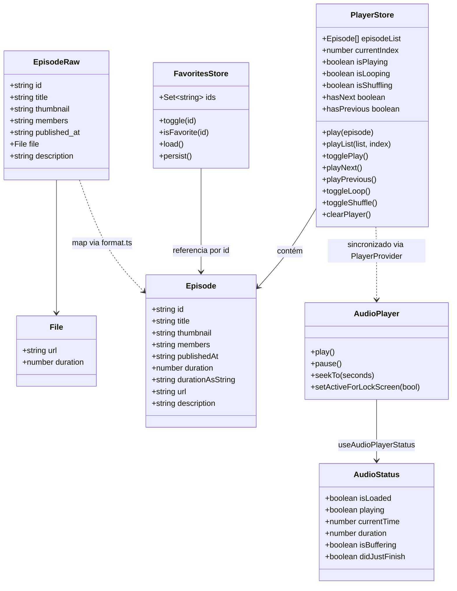
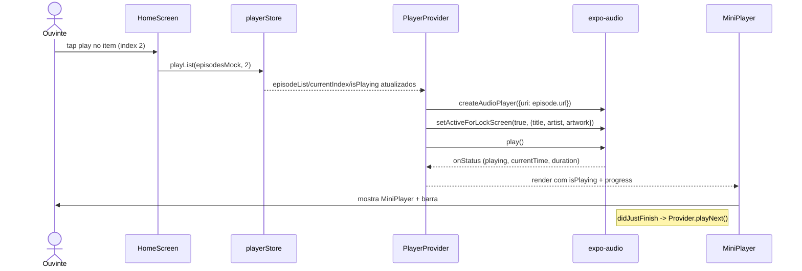
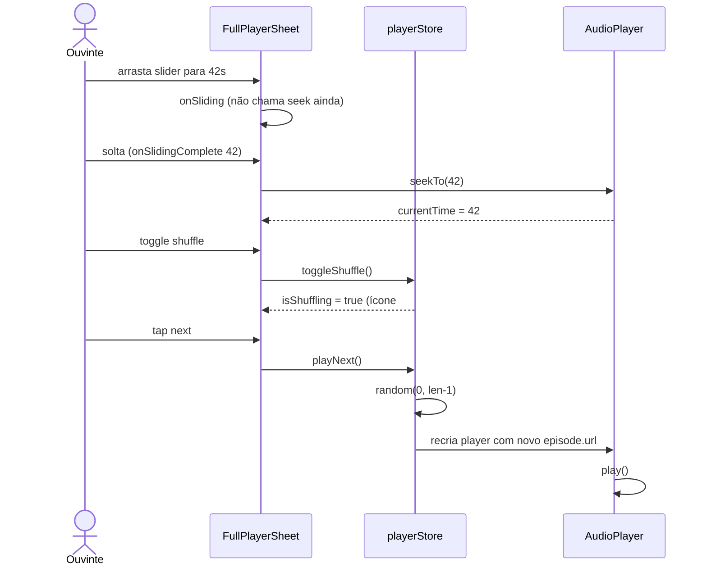
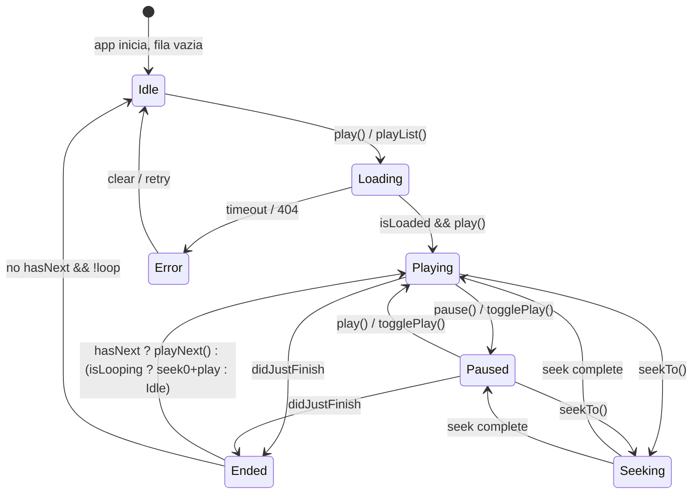
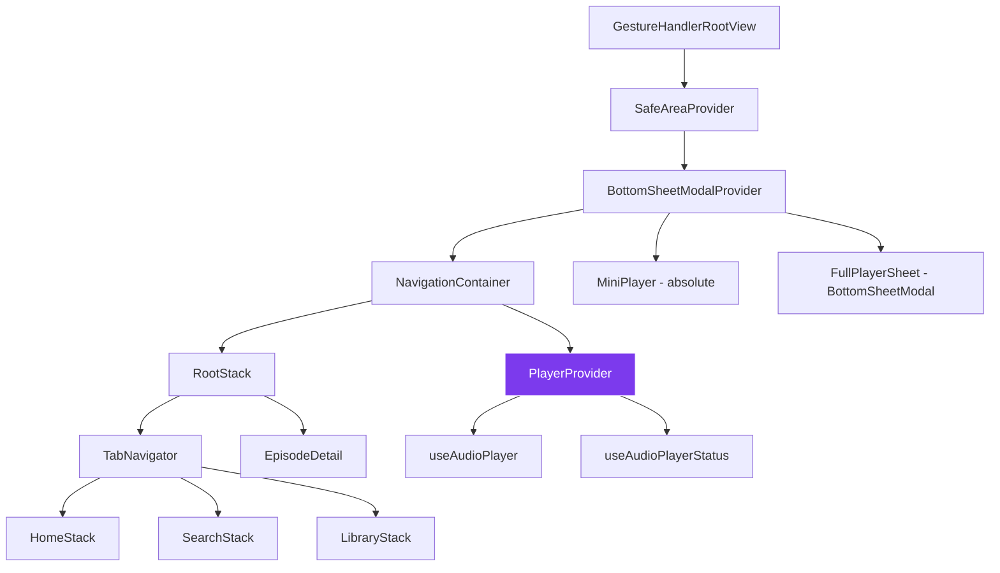
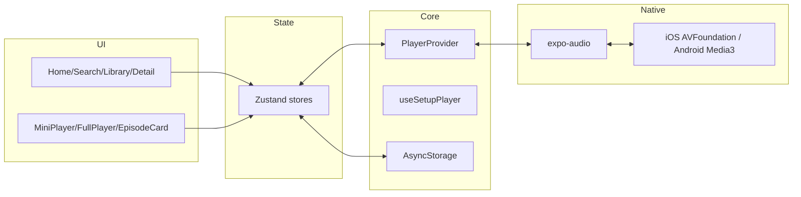

# 04 — UML

> Diagramas em Mermaid (renderizam no GitHub). Fonte da verdade para código: `src/types/episode.ts:1`, `src/store/playerStore.ts:1`, `App.tsx:10`.

## 1. Diagrama de Classes (Domínio + Player)



## 2. Sequência — Tocar episódio da Home



## 3. Sequência — Seek + Shuffle



## 4. Diagrama de Estados — Player



Estados mapeados para `src/store/playerStore.ts:1` (`isPlaying`) + `AudioStatus` (`isLoaded`, `didJustFinish`, `isBuffering`).

## 5. Arquitetura — Navegação + Providers



Hierarquia de `App.tsx:1`:

```
App.tsx
├─ GestureHandlerRootView
│  └─ SafeAreaProvider
│     └─ BottomSheetModalProvider
│        ├─ NavigationContainer (RootStack → Tabs)
│        ├─ PlayerProvider (lógica global)
│        ├─ MiniPlayer (global overlay)
│        └─ FullPlayerSheet (global modal)
```

## 6. Arquitetura — Camadas



## 7. Diagrama de Pacotes (estrutura de pastas)

```
src/
├─ types/        -> Episode, EpisodeRaw
├─ lib/          -> format.ts (pure)
├─ mocks/        -> episodes.ts (dados fake)
├─ store/        -> playerStore.ts, favoritesStore.ts
├─ hooks/        -> useSetupPlayer, useCurrentEpisode
├─ navigation/   -> RootNavigator, TabNavigator
├─ screens/      -> Home, Search, Library, EpisodeDetail
├─ components/   -> MiniPlayer, FullPlayerSheet, EpisodeCard/Row
└─ providers/    -> PlayerProvider
```

---

*Próximo: [05 — Arquitetura](./05-arquitetura.md)*
