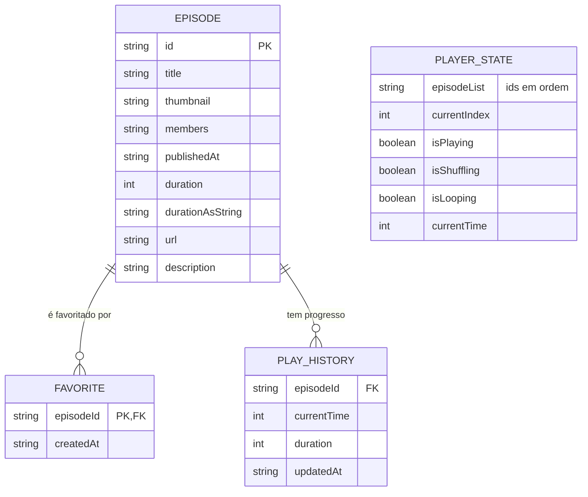

# 06 — Modelo de Dados

## 1. Entidades



## 2. Definição — Episode

Fonte: `src/types/episode.ts:1` e `src/mocks/episodes.ts:4`.

```ts
// Bruto (como vem da API / server.json do NLW)
type EpisodeRaw = {
  id: string;               // slug, ex: "a-importancia-do-typescript"
  title: string;            // ex: "A importância do TypeScript no Front-end"
  thumbnail: string;        // URL https
  members: string;          // "Diego Fernandes, João Pedro"
  published_at: string;     // ISO "2024-03-15T08:00:00Z"
  file: { url: string; duration: number }; // url mp3, duration em segundos
  description: string;      // HTML "<p>...</p>"
};

// Normalizado (usado no app)
type Episode = {
  id: string;
  title: string;
  thumbnail: string;
  members: string;
  publishedAt: string;      // ISO, renomeado
  duration: number;         // segundos
  durationAsString: string; // "47:23" via convertDurationToTimeString
  url: string;              // file.url
  description: string;      // HTML
};
```

**Mapeamento:**

```ts
// src/mocks/episodes.ts:68
episodesMock = raw.map(ep => ({
  id: ep.id,
  title: ep.title,
  thumbnail: ep.thumbnail,
  members: ep.members,
  publishedAt: ep.published_at,
  duration: ep.file.duration,
  durationAsString: convertDurationToTimeString(ep.file.duration),
  url: ep.file.url,
  description: ep.description,
}));
```

## 3. Helpers de Formatação

`src/lib/format.ts:1`:

| Função | Entrada | Saída | Regra |
|--------|---------|-------|-------|
| `convertDurationToTimeString(2843)` | `number` seg | `"47:23"` | `HH:MM:SS` ou `MM:SS`, pad 2 |
| `formatPublishedAt("2024-03-15T08:00:00Z")` | ISO | `"15 mar 2024"` | `Intl pt-BR` |

## 4. Dados Mock (Fase 0)

5 episódios em `src/mocks/episodes.ts:4` (SoundHelix mp3 + Unsplash):

| id | title | duration | url |
|----|-------|----------|-----|
| `a-importancia-do-typescript` | A importância do TypeScript... | 2843 | SoundHelix-Song-1 |
| `react-native-vs-flutter` | React Native vs Flutter... | 2130 | Song-2 |
| `expo-sdk-53-novidades` | Expo SDK 53... | 1895 | Song-3 |
| `podcastr-mobile-ux` | UX de player mobile... | 2450 | Song-5 |
| `zustand-vs-redux` | Zustand vs Redux... | 1670 | Song-8 |

Capa: `https://images.unsplash.com/...?w=600` (já com w). Descrição: HTML simples.

## 5. Persistência

### AsyncStorage — chaves

| Chave | Valor | Quando salva |
|-------|-------|--------------|
| `bookcastr:player` | `{episodeList: Episode[], currentIndex: number, currentTime: number, isLooping, isShuffling}` | throttle 1s se `isPlaying` |
| `bookcastr:favorites` | `string[]` (ids) | toggle |
| `bookcastr:searchHistory` | `string[]` (5 últimos) | busca |

Exemplo `bookcastr:player`:

```json
{
  "episodeList": [{ "id": "a-importancia...", "title": "...", "url": "..." }],
  "currentIndex": 0,
  "currentTime": 742.3,
  "isLooping": false,
  "isShuffling": false,
  "updatedAt": "2026-09-10T16:50:00Z"
}
```

**Política:** não salvar a cada frame; `load` no mount do `PlayerProvider`, `save` via `subscribe` + `setTimeout 1000`.

### Zustand — estado volátil

```ts
// src/store/playerStore.ts:1
{
  episodeList: Episode[],
  currentIndex: number,
  isPlaying: boolean,
  isLooping: boolean,
  isShuffling: boolean,
  // derivados
  hasNext, hasPrevious, currentEpisode
}
```

`hasNext/hasPrevious` são **selectors**, não `get` (Zustand não suporta getter reativo). Futuro: `createSelectors`.

## 6. Evolução — API real

| Fase | Fonte | Tipo |
|------|-------|------|
| MVP (atual) | `src/mocks/episodes.ts` | local |
| Fase 3 | `json-server` ou `Prisma + SQLite` | REST `GET /episodes` |
| Futuro | RSS / Spotify API | fetch + cache |

Contrato REST futuro:

```
GET /episodes?search=typescript
→ Episode[]

GET /episodes/:id
→ Episode

POST /favorites {id}
→ void (local por enquanto)
```

## 7. Integridade

- `id` é PK, slug único, usado para navegação `EpisodeDetail` (`bookcastr://episode/:id`)
- `url` deve ser `https` mp3/m4a; se falhar → RN-18
- `thumbnail` fallback para `assets/icon.png` se 404
- `duration` sempre `number` inteiro segundos; se `0` → mostra `--:--`

---

*Próximo: [07 — Glossário](./07-glossario.md)*
