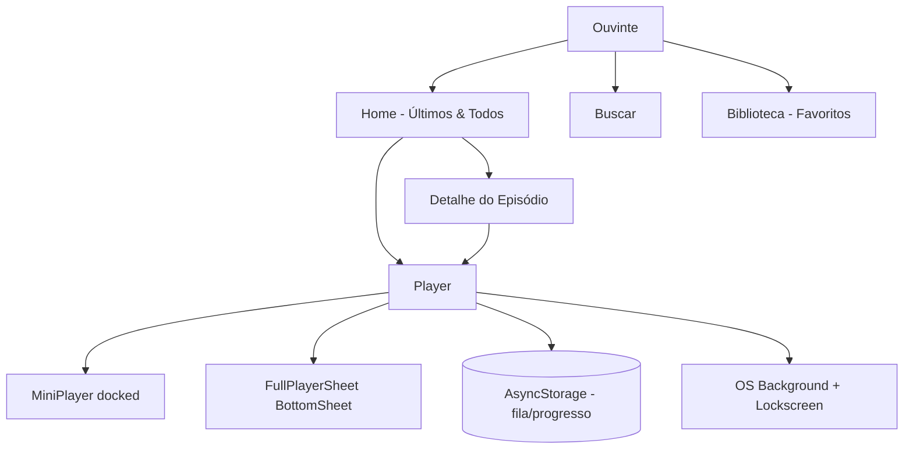

# Documentação — Bookcastr

> App mobile de podcasts inspirado no **Podcastr NLW** (Rocketseat), reimaginado **mobile-first** com player nativo.

Esta pasta concentra toda a documentação de produto e engenharia. Cada arquivo é independente mas referencia os demais.

## Mapa

| Doc | Conteúdo | Status |
|-----|----------|--------|
| [01 — Requisitos](./01-requisitos.md) | Funcionais (RF), Não-funcionais (RNF), priorização MoSCoW e rastreabilidade com milestones/issues | ✅ |
| [02 — Regras de Negócio](./02-regras-de-negocio.md) | RN-01 … RN-18 — player, fila, progresso, favoritos, background | ✅ |
| [03 — Casos de Uso](./03-casos-de-uso.md) | Atores, diagrama geral (Mermaid), 9 casos detalhados (UC-01 … UC-09) | ✅ |
| [04 — UML](./04-uml.md) | Diagrama de classes, sequência (play), estados do player e arquitetura de navegação | ✅ |
| [05 — Arquitetura](./05-arquitetura.md) | Stack, decisões (ADR), estrutura de pastas, fluxo de dados Zustand+expo-audio | ✅ |
| [06 — Modelo de Dados](./06-modelo-de-dados.md) | Entidades, ER, exemplo `Episode`, mocks e persistência | ✅ |
| [Glossário](./07-glossario.md) | Termos do domínio (episódio, fila, shuffle, etc.) | ✅ |

## Diagrama Geral do Produto

## Como usar esta docs

1. **Produto/PO:** comece por `01-requisitos` → `02-regras` → `03-casos-de-uso`.
2. **Dev:** `05-arquitetura` → `04-uml` → `06-modelo-de-dados` + código em `src/`.
3. **Design:** `03-casos-de-uso` (fluxos) + `04-uml` (estados do player) para prototipar.

## Rastreabilidade

Cada RF/RN/UC referencia:

- **Milestone GitHub:** [Fase 1](https://github.com/IamThiago-IT/Bookcastr/milestone/1) … [Fase 4](https://github.com/IamThiago-IT/Bookcastr/milestone/4)
- **Issues:** #1 … #8
- **Código:** `src/store/playerStore.ts:1`, `src/mocks/episodes.ts:4`, `App.tsx:10`, `app.json:15`

## Convenções

- IDs: `RF-01`, `RNF-03`, `RN-07`, `UC-04`
- Prioridade MoSCoW: **M**ust, **S**hould, **C**ould, **W**on't (nesta versão)
- Fonte da verdade para tipos: `src/types/episode.ts:1`
- Formatação: `src/lib/format.ts:1`

## Atualização

Docs são **vivas**. Ao implementar uma issue, atualize o `Status` nas tabelas e, se mudar regra, registre em `02-regras-de-negocio` com data.

---

*Última atualização: 2026-09-10 — Fase 0 concluída (v0.1.0).*
